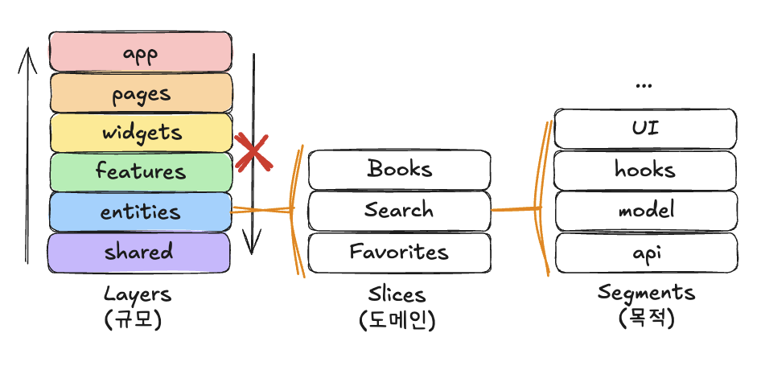

# CDRI 프론트엔드 사전과제

## 프로젝트 개요

CDRI 사전과제를 위한 프론트엔드 도서 검색 애플리케이션 입니다.

SPA 형태로 제작되었으며, 클라이언트 사이드 렌더링으로만 렌더링 합니다.

FSD 아키텍쳐를 통해 디렉터리를 구성하였습니다.

주 사용 라이브러리와 환경은 다음과 같습니다.

노드 버전은 lts 버전으로 제출 당시 22.x 버전입니다. `.nvmrc` 파일에 명기해 놓았습니다.

패키지 매니저: `pnpm`

번들러: `vite`

렌더링: `react` , `react-dom`

상태관리: `react-query` , `zustand`

라우팅: `react-router-dom`

스타일링: `tailwind v4`

## 실행 방법 및 환경 설정

프로젝트 실행 방법

`package.json` 파일이 있는 프로젝트의 루트 디렉터리에서 `.env.local` 파일을 다운 받거나, `.env.sample` 파일의 이름을 `.env.local` 로 변경해 환경변수 값을 채운 후 아래와 같이 명령어를 실행합니다.

**의존성 설치:**

```shell
pnpm install
````

**개발모드 실행:**

```shell
pnpm dev
```

**빌드 후 실행:**

```shell
pnpm build
pnpm preview
```

## 폴더 구조 및 주요 코드 설명

FSD 아키텍쳐를 이용해 폴더 구조를 구성하여 다음과 같이 3 depth 로 나누어 관리 합니다. 첫번째 depth는 규모에 따라 다음과 같이 7개의 폴더로 나누어 관리하며 각 규모 폴더 내부에는 관련 도메인인 `books`, `search`, `favorites` 로 나누어 하위에 목적에 맞는 폴더를 만들어 구분 합니다.



FSD 를 통해 프로젝트를 관리하면 규모로 컴포넌트를 나누기 때문에 `import` 문을 통한 기능 파악이 용이하며, 규모에 맞지 않는 `import` 를 하는 경우도 좀 더 빠르게 파악 할 수 있습니다. 또한, `index.ts` 파일로 `export` 하여 alias 포함 절대경로로 `import` 하게 되면, 파일을 다른 디렉터리로 옮기더라도, `import` 문을 고치지 않아도 된다는 소소한 이점도 있습니다.

**프로젝트 디렉터리 간단 설명:**

```plain text
📦 src
├── 📁 app                  # 앱 초기화, 레이아웃, 라우터 설정 등 (전역 설정)
│   └── index.tsx             # App 컴포넌트 루트
│
├── 📁 shared               # 재사용 가능한 범용 컴포넌트, 타입, 유틸 함수
│   ├── 📁 hooks              # 공통적으로 사용될 커스텀 훅 (컨테이너 바깥 클릭을 감지하는 커스텀 훅)
│   ├── 📁 providers          # 프로바이더
│   ├── 📁 ui                 # button, input, tooltip 등 디자인 시스템 요소
│   └── 📁 utis               # 글로벌 유틸 함수
│
├── 📁 entities             # 도메인 모델 단위의 최소 단위
│   ├── 📁 books              # 도서 관련 클래스, 작은 단위의 ui 컴포넌트 (view 만 있는 컴포넌트)
│   │   ├── model               # 도서 관련 정보를 재가공 해주는 역할을 하는 클래스
│   │   └── ui                  # view 만 있는 컴포넌트
│   ├── 📁 favorites          # 즐겨찾기 관련 타입과 작은 단위의 ui 컴포넌트
│   │   ├── types               # SearchInput, DetailSearchModal 등
│   │   └── ui                  # 관련 유틸 함수
│   └── 📁 search             # 검색 관련 타입과 작은 단위의 ui 컴포넌트
│       ├── types               # SearchInput, DetailSearchModal 등
│       └── ui                  # 관련 유틸 함수
│
├── 📁 features             # 사용자 행동 단위 기능 (작은 비즈니스 로직 단위)
│   ├── 📁 books              # 도서 관련 사용자 행동 단위 기능들
│   │   ├── api                 # 백엔드 직접 호출 fetch 코드
│   │   ├── hooks               # 도서 관련 react-query hooks 
│   │   ├── types               # 백엔드 호출 관련 타입
│   │   └── ui                  # 도서 관련 사용자 행동 단위 규모의 컴포넌트
│   ├── 📁 favorites          # 즐겨찾기 관련 사용자 행동 단위 기능들
│   │   └── hooks               # 즐겨찾기 관련 zustand store
│   └── 📁 search             # 검색 관련 사용자 행동 단위 기능들
│       ├── hooks               # 검색 관련 zustand store
│       └── ui                  # 검색 관련 사용자 행동 단위 규모의 컴포넌트
│
├── 📁 pages                # 라우트 단위 (페이지)
│   ├── 📁 books              # 도서 상세 페이지 (/books/:isbn)
│   │   └── index.tsx           # 도서 상세 페이지이지만, routing 으로 isbn 을 받는 정도로만 구현
│   ├── 📁 favorites          # 즐겨찾기 페이지 (/favorites)
│   │   └── index.tsx           # 즐겨찾기 페이지
│   └── 📁 search             # 도서 상세 페이지 (/search)
│       └── index.tsx           # 검색 페이지
│
├── 📁 widgets              # 자체로 하나의 완전한 기능이 되는 공통적 사용 가능한 기능들
│   ├── header.tsx            # 헤더 컴포넌트
│   └── layout.tsx            # 전체 공용 레이아웃
│
└── main.tsx              # 앱 진입점
```

### 주요 코드 설명

```typescript
import {
  useQuery,
  type QueryFunction,
  type QueryKey,
  type UseQueryOptions,
  type UseQueryResult,
} from "@tanstack/react-query";
import { KakaoSortTypes, type KakaoSort } from "../types";
import { getSearchBooks } from "../api";

export const getSearchBooksQueryKey = (
  query: string,
  sort: KakaoSort = KakaoSortTypes.AccuracySort,
  page = 1,
  size = 10,
  target: string | undefined = undefined,
) => ["book", query, sort, page, size, target] as const;

export const getSearchBooksQueryOptions = <
  TData = Awaited<ReturnType<typeof getSearchBooks>>,
  TError = unknown,
>(
  query: string,
  sort: KakaoSort = KakaoSortTypes.AccuracySort,
  page = 1,
  size = 10,
  target: string | undefined = undefined,
  options?: {
    query?: Partial<
      UseQueryOptions<Awaited<ReturnType<typeof getSearchBooks>>, TError, TData>
    >;
  },
) => {
  const { query: queryOptions } = options ?? {};

  const queryKey =
    queryOptions?.queryKey ??
    getSearchBooksQueryKey(query, sort, page, size, target);

  const queryFn: QueryFunction<
    Awaited<ReturnType<typeof getSearchBooks>>
  > = () => getSearchBooks(query, sort, page, size, target);

  return { queryKey, queryFn, ...queryOptions } as UseQueryOptions<
    Awaited<ReturnType<typeof getSearchBooks>>,
    TError,
    TData
  > & {
    queryKey: QueryKey;
  };
};

export const useGetSearchBooksQuery = <
  TData = Awaited<ReturnType<typeof getSearchBooks>>,
  TError = unknown,
>(
  query: string,
  sort: KakaoSort = KakaoSortTypes.AccuracySort,
  page = 1,
  size = 10,
  target: string | undefined = undefined,
  options?: {
    query?: Partial<
      UseQueryOptions<Awaited<ReturnType<typeof getSearchBooks>>, TError, TData>
    >;
    request?: Parameters<typeof fetch>[1];
  },
): UseQueryResult<TData, TError> => {
  const queryOptions = getSearchBooksQueryOptions(
    query,
    sort,
    page,
    size,
    target,
    options,
  );

  const queryResult = useQuery(queryOptions);

  return queryResult;
};
```

리액트 쿼리를 사용할 때, QueryOptions 객체를 사용해, 재사용성을 높였습니다. 현 프로젝트에서는 사용하지 않는 인자들도 있지만, 백엔드 API 에 맞추어 활용할 수 있도록 대비하였습니다.

```typescript
//************ 타입 ***********//
export const SearchTargetOptions = {
  title: "title",
  author: "author",
  publisher: "publisher",
} as const;
export type SearchTargetOptions =
  (typeof SearchTargetOptions)[keyof typeof SearchTargetOptions];

export type SearchState = {
  pageInputValue: string;
  modalInputValue: string;
  modalSelectValue: SearchTargetOptions;
  searchKeyword: string;
  searchTarget?: SearchTargetOptions;
};
export type SearchActions = {
  setPageInputValue: (value: string) => void;
  setModalInputValue: (value: string) => void;
  setModalSelectValue: (value: SearchTargetOptions) => void;
  pageSearch: (keyword?: string) => void;
  modalSearch: () => void;
  resetPageSearchInput: () => void;
  resetModalSearchInput: () => void;
};
export type SearchStore = SearchState & SearchActions;

export type SearchHistoryState = {
  searchHistory: string[];
};
export type SearchHistoryActions = {
  addSearchHistory: (keyword: string) => void;
  removeSearchHistory: (keyword: string) => void;
  clearSearchHistory: () => void;
};
export type SearchHistoryStore = SearchHistoryState & SearchHistoryActions;

//************ 구현 ***********//
import { create } from "zustand";
import { type SearchStore, SearchTargetOptions } from "@/entities/search";

export const useSearchStore = create<SearchStore>((set, get) => ({
  // 화면에 보이는 검색어 상태 값
  pageInputValue: "",
  modalInputValue: "",
  modalSelectValue: SearchTargetOptions.title,
  // 검색어를 입력하고 검색 시작 시 상태 값
  searchKeyword: "",
  searchTarget: undefined,

  setPageInputValue: (value: string) => set({ pageInputValue: value }),
  setModalInputValue: (value: string) => set({ modalInputValue: value }),
  setModalSelectValue: (value: SearchTargetOptions) =>
    set({ modalSelectValue: value }),

  pageSearch: (keyword?: string) => {
    if (keyword) {
      set({
        pageInputValue: keyword,
        searchKeyword: keyword,
        searchTarget: undefined,
      });
      return;
    }
    set({
      searchKeyword: get().pageInputValue,
      searchTarget: undefined,
    });
  },
  modalSearch: () =>
    set({
      searchKeyword: get().modalInputValue,
      searchTarget: get().modalSelectValue,
    }),
  resetPageSearchInput: () => set({ pageInputValue: "" }),
  resetModalSearchInput: () =>
    set({ modalInputValue: "", modalSelectValue: SearchTargetOptions.title }),
}));
```

zustand 를 통해 다양한 컴포넌트에서 복합적으로 활용해야하는 search 관련 상태 관리를 하였습니다. 화면에 보이는 검색어 상태 값을 초기화 하는 요구사항이 있기에 uncontrolled 로 활용하지 않고, controlled 로 두도록 하였습니다. 화면에 보이는 검색어 상태 값들은 따로 화면에만 보이고, 검색을 할 때에는 화면에 보이던 상태값인 `pageInputValue`, `modalInputValue` , `modalSelectValue` 에서 검색 조건을 반영해 검색하도록 검색 상태를 변경합니다. 이 검색 상태는 앞선 `useGetSearchBooksQuery` 에서 인자로 받아 페이지에서 반영됩니다.

## 라이브러리 선택 이유

### zustand

굉장히 가볍고(번들 사이즈가 작고) 사용하기 간편하며, `persist` api 로 localStorage 등의 브라우저 스토리지 사용을 지원하기 때문에 공통 훅과도 연계가 좋을 것이라 판단해 사용하였습니다. search 관련 비즈니스 로직이 복잡해져서, context api 로는 관리가 힘들어졌으며, 추후 localStorage 를 통해 상태에 반영해야하는 요구사항도 있기 때문에 동시에 같이 관리할 때 사용하면 좋을 것 같아 선택하였습니다.

### biome

기본 lint 가 생각지 못했던 a11y 에 관한 것들을 잘 잡아주며, 성능도 빠르고, 적용도 쉬워 lint 적용을 위해 사용하였습니다.

### tailwind-merge, clsx, class-variance-authority

tailwind 의 JIT (런타임에서 템플릿 리터럴 형태로 tailwind 클래스를 변경 적용하는 방식) 모드가 반영되지 않는 부분이 있어서 사용한 유틸 라이브러리 입니다. shadcn/ui 에서 사용하는 유틸 함수를 만들어 사용하기 위해 추가하였습니다.

### @radix-ui/react-tooltip

shadcn/ui 의 tooltip 컴포넌트를 빠르게 적용하기 위해 필요한 의존성인 해당 라이브러리를 추가하였습니다. 요구사항에는 없었지만, 책 제목이 너무 길면 컴포넌트 크기가 변화되어 관리하기 어려워 1줄로 강제 후 ellipsis 처리하고, 툴팁을 추가하였습니다. shadcn/ui 전체를 사용하기엔 사용할 공통 컴포넌트가 많지 않다고 판단하여 해당 라이브러리만 추가하였습니다.

## 강조 하고 싶은 기능

**엔티티 도메인 클래스:**

```typescript
interface IBook {
  title: string;
  contents: string;
  url: string;
  isbn: string;
  datetime: string;
  authors: string[];
  publisher: string;
  translators: string[];
  price: number;
  sale_price: number;
  thumbnail: string;
  status: string;
}

export class Book implements IBook {
  public title;
  public contents;
  public url;
  public isbn;
  public datetime;
  public authors;
  public publisher;
  public translators;
  public price;
  public sale_price;
  public thumbnail;
  public status;

  protected constructor({
    title,
    contents,
    url,
    isbn,
    datetime,
    authors,
    publisher,
    translators,
    price,
    sale_price,
    thumbnail,
    status,
  }: IBook) {
    this.title = title;
    this.contents = contents;
    this.url = url;
    this.isbn = isbn;
    this.datetime = datetime;
    this.authors = authors;
    this.publisher = publisher;
    this.translators = translators;
    this.price = price;
    this.sale_price = sale_price;
    this.thumbnail = thumbnail;
    this.status = status;
  }

  public static create(data: IBook) {
    if (data instanceof Book) return data;
    return new Book(data);
  }

  get priceTag() {
    return `${this.price.toLocaleString()}원`;
  }

  get salePriceTag() {
    if (this.sale_price < 0) return undefined;
    return `${this.sale_price.toLocaleString()}원`;
  }
}

```

해당 클래스를 통해 중요한 비즈니스 도메인 엔티티의 실제 값과 그 값을 통해 재정의 되는 유사하지만 살짝 다른 표현 방식이 프론트엔드에서는 상당히 많았습니다. 백엔드에서 그대로 내려주는 값을 바로 사용하면 좋겠지만, 항상 그럴수는 없기에, 이러한 클래스를 통해 어떤 엔티티에 대한 모든 표현들을 이 클래스 내부에서 관리 할 수 있도록 하였습니다.

한 화면에 너무 많은 도메인 엔티티 클래스의 인스턴스가 생기게 된다면, 추가적인 로드가 발생할 수 있지만, 작은 규모라면 오히려 관리가 용이할 것이라고 생각합니다.

```typescript
import {
  BookListItem,
  BookListItemSkeleton,
  EmptyBookList,
} from "@/entities/books";
import type { Book } from "@/entities/books";
import { useFavoritesStore } from "@/features/favorites";

interface BookListProps {
  isLoading?: boolean;
  bookList: Book[];
}

export function BookList({ isLoading, bookList }: BookListProps) {
  const { isFavorite, toggleFavorite } = useFavoritesStore();

  if (isLoading) {
    return (
      <ul className="max-w-240">
        {Array.from({ length: 10 }, () => (
          <BookListItemSkeleton
            key={`book_list_item_skeleton:${Math.random()}`}
          />
        ))}
      </ul>
    );
  }
  if (bookList.length === 0) {
    return <EmptyBookList message="검색된 결과가 없습니다." />;
  }
  return (
    <ul className="max-w-240">
      {bookList.map((book) => (
        <BookListItem
          key={book.isbn}
          book={book}
          isFavorite={isFavorite(book.isbn)}
          onToggleFavorite={() => toggleFavorite(book)}
        />
      ))}
    </ul>
  );
}

```

feature 단위의 책 리스트를 보여주는 컴포넌트입니다. 여기서는 백엔드 api 로딩 시 CLS 를 최소화 하기 위해 스켈레톤을 추가하였습니다.

```typescript
import { keepPreviousData } from "@tanstack/react-query";
import { Book } from "@/entities/books";
import { BookList, useGetSearchBooksQuery } from "@/features/books";
import {
  DetailSearchModal,
  SearchInput,
  useSearchStore,
} from "@/features/search";

export function SearchBooksPage() {
  const { searchKeyword, searchTarget } = useSearchStore();

  const { data: searchBooksData, isLoading } = useGetSearchBooksQuery(
    searchKeyword,
    "accuracy",
    1,
    10,
    searchTarget,
    {
      query: {
        select: (data) => ({
          meta: data.meta,
          documents: data.documents.map(Book.create),
        }),
        enabled: !!searchKeyword,
        placeholderData: keepPreviousData,
      },
    },
  );

  return (
    <section className="mx-auto p-4 flex flex-col gap-6">
      <h1 className="text-cdri-title2">도서 검색</h1>
      <div className="flex items-center gap-4">
        <SearchInput />
        <DetailSearchModal />
      </div>
      <p className="flex gap-4">
        도서 검색 결과
        <span>
          총{" "}
          <span className="text-cdri-primary">
            {searchBooksData?.meta.total_count ?? 0}
          </span>
          건
        </span>
      </p>
      <BookList
        bookList={searchBooksData?.documents ?? []}
        isLoading={isLoading}
      />
    </section>
  );
}

```

또한 `useGetSearchBooksQuery` 를 사용활 때, `placeholderData: keepPreviousData` 옵션을 통해 로딩 시 스켈레톤을 계속 렌더링하는 깜빡임 현상도 줄였습니다.
